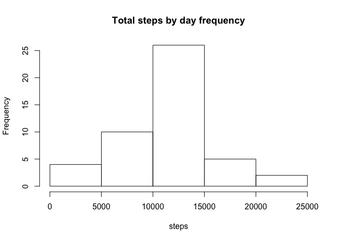
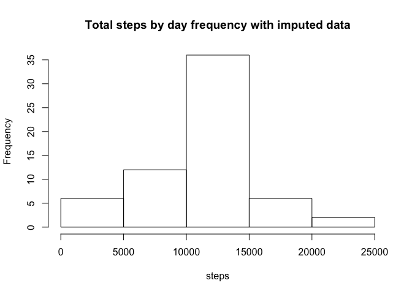
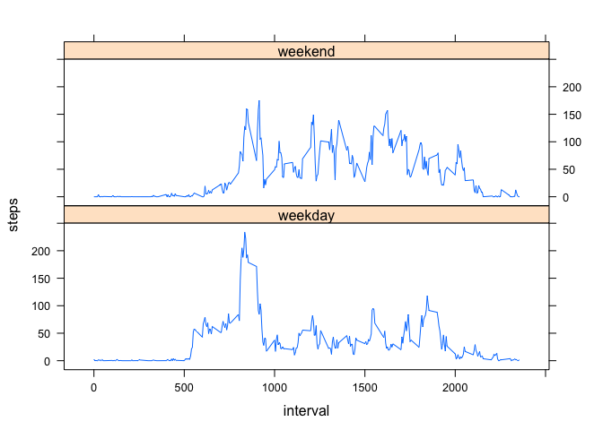

This report will visualize data gathered with a personal activity monitoring device. We will first load the _lattice_ library and set global options.


```r
library(lattice)
options(echo = TRUE, scipen = 1, digits = 2)
```

## Loading and preprocessing the data

First step is to load the data from associated _.csv_ file. After reading, we'll augment the `date` column with timestamp data from `interval` column and then convert it to type `POSIXct`.


```r
activityData <- read.csv('activity.csv', colClasses=c("numeric", "character", "numeric"))
activityData$date <- as.POSIXct(
  paste(
    activityData$date, 
    " ", 
    activityData$interval %/% 100, 
    ":", 
    activityData$interval %% 100, 
    sep = ""))
```


## What is mean total number of steps taken per day?

After reading and treating the data, we'll group it by day and calculate the sum of steps taken for each day. Then we'll display a histogram showing the distribution of activity. It appears that 10k to 15k steps per day is the most common amount of activity.


```r
totalStepsByDay <- aggregate(list(steps = activityData$steps), 
                             by=list(as.Date(activityData$date)), 
                             FUN=sum, 
                             drop = TRUE)

hist(main = "Total steps by day frequency", totalStepsByDay$steps, xlab="steps")
```

<!-- -->

Mean steps taken by day is 10977.04, median is 11144.

## What is the average daily activity pattern?

We will then explore the average daily activity pattern. This pattern is formed by averaging the amount of steps taken per timeframe across all of the days. The pattern shows a clear spike in the morning - possibly a daily commute.


```r
dailyActivityPattern <- aggregate(x = list(steps = activityData$steps), 
                                  by=list(interval = activityData$interval), 
                                  mean, 
                                  na.rm=TRUE)
rownames(dailyActivityPattern) <- dailyActivityPattern$interval
maxTimeInterval <- dailyActivityPattern[order(-dailyActivityPattern$steps)[1], ]
plot(dailyActivityPattern, type = "l")
```

<!-- -->

Time interval with the most steps is 835 with 206.17 steps.

## Imputing missing values


```r
missingValues <- activityData[is.na(activityData$steps), ]
```

The dataset contains a total of 2304 missing values (13.11% of data missing). These values will be imputed into a separate dataset from the daily activity pattern - i.e. the mean steps for each timestep.


```r
imputed <- activityData
imputed[is.na(activityData$steps), ]$steps <- unlist(lapply(missingValues$interval, function(x) { dailyActivityPattern[as.character(x), ]$steps }))

totalStepsByDayImputed <- aggregate(x=list(steps = imputed$steps), 
                                    by=list(as.Date(activityData$date)), 
                                    FUN=sum)

hist(main = "Total steps by day frequency with imputed data", xlab="steps", totalStepsByDayImputed$steps)
```

<!-- -->

Mean steps taken by day in the imputed dataset is 10592.54, median is 10752.96. These values are very close, but slightly lower. Imputing the data this way does not affect the mean and median values significantly.

## Are there differences in activity patterns between weekdays and weekends?

Finally, we'll explore the differences in activity between weekdays and weekends. There is a clear pattern of high activity in weekday mornings, whereas activity is much more constant during weekends.


```r
dayToWeekDay <- function(d) { 
  if (d == "Saturday" | d == "Sunday") { 
    "weekend"
  } else { 
    "weekday" 
  }
}

imputed$weekday <- as.factor(unlist(lapply(weekdays(activityData$date), dayToWeekDay)))
activityPerWeekday <- aggregate(x = list(steps = activityData$steps), 
                                by=list(interval = imputed$interval, 
                                        weekday = imputed$weekday), 
                                mean, 
                                na.rm=TRUE)

xyplot(steps ~ interval | weekday, data=activityPerWeekday, type="l", layout=c(1,2))
```

<!-- -->
